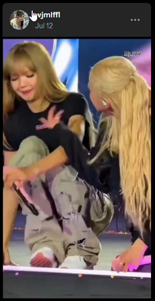

# Tumblr Video Control

> Full keyboard control for Tumblr videos: No autoplay, no surprises. Just you in charge.
> 

**P** — play with sound  
**O** — play muted  
**M** — toggle mute  
**No autoplay. Full control.**

- Blocks autoplay on all videos  
- Works after page changes  
- No UI clutter  
- Survives Tumblr redesigns

)

*(P: Play with sound | O: Muted play | M: Toggle mute)*

## Why?

- Tumblr's autoplay is chaos — this tames it.
- Works on dashboard, blogs, after infinite scroll.
- Minimal: No buttons, no clutter.
- Future-proof: Handles redesigns.

## Features

- **P**: Play video with sound
- **O**: Play muted
- **M**: Toggle mute on/off
- **Blocks all autoplay** on load/scroll
- **Survives page changes**

## Install

1. [Install Tampermonkey](https://www.tampermonkey.net/) or Violentmonkey
2. [Get it on GreasyFork](https://greasyfork.org/uk/scripts/554155-tampermonkey-tumblr-video-control)
3. Reload Tumblr — keys work instantly!

## Screenshots

## Support the Project

[☕ Buy Me a Coffee](https://buymeacoffee.com/your-nick)

Stars and PRs welcome!

## License

MIT © aeit 2025